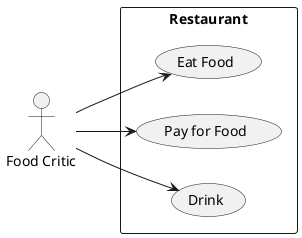

# Описание требований и архитектуры

## Введение
<!-- Общее краткое описание создаваемой системы -->
В рамках курса осуществляется проектирование решения на основе [постановки задачи от "заказчика"](./task.md).

- [Описание требований и архитектуры](#описание-требований-и-архитектуры)
  - [Введение](#введение)
  - [Заинтересованные стороны](#заинтересованные-стороны)
  - [Бизнес-контекст (бизнес-требования)](#бизнес-контекст-бизнес-требования)
  - [Глоссарий](#глоссарий)
  - [Модель предметной области](#модель-предметной-области)
  - [Требования к системе](#требования-к-системе)
    - [Сценарии использования (Use case)](#сценарии-использования-use-case)
    - [Функциональные требования](#функциональные-требования)
    - [Нефункциональные требования/Требования к атрибутам качества](#нефункциональные-требованиятребования-к-атрибутам-качества)
    - [Ограничения](#ограничения)
  - [Архитектура](#архитектура)
    - [Журнал архитектурных решений](#журнал-архитектурных-решений)
    - [Контекст решения](#контекст-решения)
    - [Компонентная архитектура](#компонентная-архитектура)
    - [Реализация сценариев использования](#реализация-сценариев-использования)
    - [Программные интерфейсы](#программные-интерфейсы)
    - [Схема развертывания](#схема-развертывания)
  
## Заинтересованные стороны
<!-- Перечень заинтересованных сторон и их интересов по отношению к создаваемой системе. 
Подробнее: https://confluence.mts.ru/pages/viewpage.action?pageId=399975538 
-->
| Заинтересованная сторона | Интересы           |
|:-------------------------|:-------------------|
| HR-сотрудник (headhunter)               | <ul><li>Получить максимальный охват потенциальных кандидатов для рекрутинга</li><li>Получить контакты потенциальных кандидатов</li><li>Привлечь потенциальных кандидатов</li></ul> |
| HR-сотрудник (conference manager)               | <ul><li>Получить инструмент работы регистрациями на **участие** в конференции (прием/отклонение, обратная связь)</li><li>Получить инструмент управления заявками на **доклады** (прием/отклонение, этапы рецензирования, обратная связь)</li><li>Иметь инструмент управления расписанием конференции (составление/изменение/публикация)</li><li>Иметь списки всех участников конференции с информацией о них (ФИО, стаж, позиция, компания, контакты и тп).</li><li>Иметь инструмент контактировать со всей аудиторией конфренции, докладчиками, тех.персоналом и тп.</li><li>Иметь инструмент управления трансляцией докладов конференции (старт/стоп трансляции, посещаемость, активность).</li><li>Иметь инструмент оценки докладов участниками конференции.</li><li>Получить способ записи и распространения эфиров конференции</li></ul> |
| Докладчик конференции               | <ul><li>Иметь инструмент подачи заявки на доклад и отслеживания статуса заявки</li><li>Получить инструмент обраной связи с администрацией конференции</li><li>Получить инструмент выхода в эфир конференции</li><li>Получить инструмент просмотра расписания конференции</li><li>Получить инструмент позволяющий отвечать на вопросы участников</li></ul> |
| Участник конференции               | <ul><li>Получить инструмент регистрации на конференцию и отслеживания статуса регистрации (принята/отклонена)</li><li>Получить инструмент просмотра программы и расписания конференции</li><li>Получить инструмент прослушивания эфира конференции</li><li>Получить инструмент позволяющий задавать вопросы докладчику</li><li>Получить инструмент оценки доклада</li></ul> |
| Технический руководитель конференции               | <ul><li>Соблюсти бюджет на КТС и разработку конференции</li><li>Реализовать инструменты работы ресурсами конференции для администрации, участников, докладчиков конференции</li><li>Обеспечить бесперебойную трансляцию докладов конференции</li><li>Обеспечить запись и распространение эфиров докладов</li></ul> |

## Бизнес-контекст (бизнес-требования)
<!-- Общее описание бизнес-контекста создаваемой системы (автоматизируемой деятельности), список бизнес-целей заинтересованных сторон 
Подробнее: https://confluence.mts.ru/pages/viewpage.action?pageId=399973845
-->
МТС нужно привлекать высококвалифицированные кадры для разработки в сфере ИТ. Для этого нужно работать с потенциальными кандидатами для повышения уровня информированности о карьерных возможностях внутри МТС, с целью рекрутинга. Для осуществления этой деятельности решено провести профильную ИТ-конференцию. Выбранный формат - онлайн-конференция. Для реализации конференции в этом формате необходимо программное решение, автоматизирующее сбор и обработку заявок на доклады, регистраций участников, управление расписанием, трансляцией, сбор обратной связи, формирование базы кандидатов.

Бизнес-цели:
- Повышение HR-бренда МТС. Измеряется степерью удовлетворенности организации конференции (трансляцией, обратной связью с участниками) и процентильной оценкой каждого доклада. Целевая оценка 4.0 в 75 процентиле для организации; 4.0 в 80 процентиле для докладов.
- Рекрутинг кандидатов. Целевое кол-во это 10 позиций на каждую из позиций: Senior|Middle Software Engineer (Java/Python), Senior|Middle Devops Engineer, Senior|Middle Data Engineer; 5 позиций Senior|Middle Data Scientist.

## Глоссарий
<!-- Содержит основные понятия и термины предметной области  
Подробнее: https://confluence.mts.ru/pages/viewpage.action?pageId=375782595
-->
| Понятие                        | Сокращение                         | Определение                       |
|:-------------------------------|:-----------------------------------|:----------------------------------|
| *Термин, обозначающий понятие* | *Сокращение термина (при наличии)* | *Развернутое определение понятия* |

## [Модель предметной области](data/data.md)

## Требования к системе

### Сценарии использования (Use case)
<!-- Подробное описание сценариев использования системы с привязкой к ролям участников и задействованным бизнес-сущностям 
https://confluence.mts.ru/pages/viewpage.action?pageId=375782108 
https://confluence.mts.ru/pages/viewpage.action?pageId=375782119 
-->
#### Диаграмма сценариев использования (Use Case Diagram) <!-- omit in toc -->

#### Список сценариев использования <!-- omit in toc -->

| ID     | Описание                                          |
|--------|---------------------------------------------------|
| UC.001 | *[Название сценария использования](uc/uc.001.md)* |

### Функциональные требования
<!-- Описание требований к функциям, реализуемым системой. Требование может быть привязано к сценарию использования или быть общим 
Подробнее: https://confluence.mts.ru/pages/viewpage.action?pageId=375782501 
-->
| ID     | Функциональное требование             |
|--------|---------------------------------------|
| FR.001 | *Описание функционального требования* |

### Нефункциональные требования/Требования к атрибутам качества
<!-- Требования к основным архитектурным характеристикам (атрибутам качества) системы - надежность, масштабируемость, ИБ, и др.
Подробнее: https://confluence.mts.ru/pages/viewpage.action?pageId=375782530
-->
| ID     | Атрибут качества             | Описание требования                       |
|--------|------------------------------|-------------------------------------------|
| QR.001 | *Название атрибута качества* | *Описание требования к атрибуту качества* |

### Ограничения
<!-- Описываются ограничения, оказывающие влияние на архитектуру системы - временные, финансовые, технологические
Подробнее: https://confluence.mts.ru/pages/viewpage.action?pageId=375782592
-->
| ID     | Ограничение            |
|--------|------------------------|
| AC.001 | *Описание ограничения* |

## Архитектура

### Журнал архитектурных решений
<!-- Записи о ключевых принятых архитектурных решениях (ADR) для реализации архитектурно-значимых требований.
Подробнее: https://confluence.mts.ru/pages/viewpage.action?pageId=421162308
-->
- [ADR.NNN Суть решения](adr/adr-template.md)

### [Контекст решения](context/context.md)

### [Компонентная архитектура](components/components.md)

### Реализация сценариев использования
<!-- Реализация сценариев использования на основе взаимодействия компонентов системы и внешних систем/участников.
Диаграммы последовательности (UML Sequence diagram) и текстовое описание.

Подробнее: 
https://confluence.mts.ru/pages/viewpage.action?pageId=399442132
https://confluence.mts.ru/pages/viewpage.action?pageId=399442170
-->
| ID     | Описание                          | Реализация                                    |
|--------|-----------------------------------|-----------------------------------------------|
| UC.001 | *Название сценария использования* | [Реализация сценария](uc-impl/uc.001-impl.md) |

### Программные интерфейсы
<!-- Спецификации публичных API системы и ее компонентов (синхронных, событийных). Создается на основе модели предметной области для реализации сценариев использования. 
  Форматы: OAS/Swagger, GraphQL, AsyncAPI/CloudEvents
-->
| Компонент             | Интерфейс                                      |
|:----------------------|:-----------------------------------------------|
| *Название компонента* | *[Название интерфейса](api/service-name.yaml)* |

### [Схема развертывания](deployment/deployment.md)
